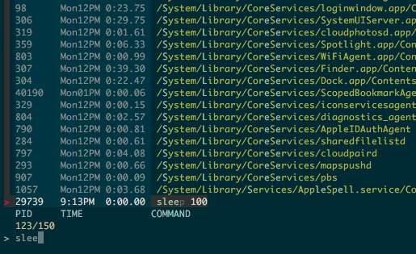

pkill.sh
========

Kill processes by filtering tool



## Usage

```console
$ F="fzy -l 30:fzf-tmux:peco --layout=bottom-up" bash pkill.sh
```

## Installation

```zsh
zplug 'b4b4r07/pkill.sh', as:command, use:'pkill.sh', rename-to:'pk'
```

## License

MIT

## Author

b4b4r07
